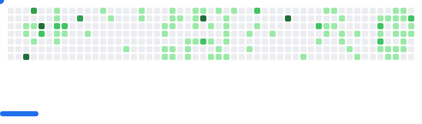

# 🧑‍💻 Hi there, I'm Daniel Ortiz 👋

I'm a **Computer Science student (7th semester)** at **Universidad Pontificia Bolivariana (UPB)** 🤩  

I build solutions that connect **software development and data science,** combining **full-stack development, data analysis, and machine learning** to turn data into **scalable and high-impact applications.**

<!--Here you’ll find my **GitHub stats**, a showcase of the tools and programming languages I frequently work with and the **certifications & badges** I have earned. 😄-->

<!-- ## 📊 GitHub Stats -->
<!--  -->

## 🛠 Technologies & Tools
 &nbsp;
 &nbsp;
 &nbsp;
 &nbsp;
 &nbsp;
 &nbsp;
 &nbsp;
 &nbsp;
<!--  &nbsp; -->
 &nbsp;
 &nbsp;
 &nbsp;
 &nbsp;
 &nbsp;
 &nbsp;
 &nbsp;

## 🏆 Certifications & Badges

## 🌐 Connect with Me
 &nbsp;

---

<picture>
  <source media="(prefers-color-scheme: dark)" srcset="images/breakout-dark.svg">
  <source media="(prefers-color-scheme: light)" srcset="images/breakout-light.svg">
  
</picture>

_Built with [cyprieng/github-breakout](https://github.com/cyprieng/github-breakout)_

<!--
**dano796/dano796** is a ✨ *special* ✨ repository because its `README.md` (this file) appears on your GitHub profile.
Here are some ideas to get you started:
- 🔭 I'm currently working on ...
- 🌱 I'm currently learning ...
- 👯 I'm looking to collaborate on ...
- 🤔 I'm looking for help with ...
- 💬 Ask me about ...
- 📫 How to reach me: ...
- 😄 Pronouns: ...
- ⚡ Fun fact: ...
- References:
  https://github.com/anuraghazra/github-readme-stats
  https://github.com/alexandresanlim
  https://github.com/alexandresanlim/Badges4-README.md-Profile
  https://hendrasob.github.io/badges/
  https://devicon.dev
  https://rahuldkjain.github.io/gh-profile-readme-generator/
-->
